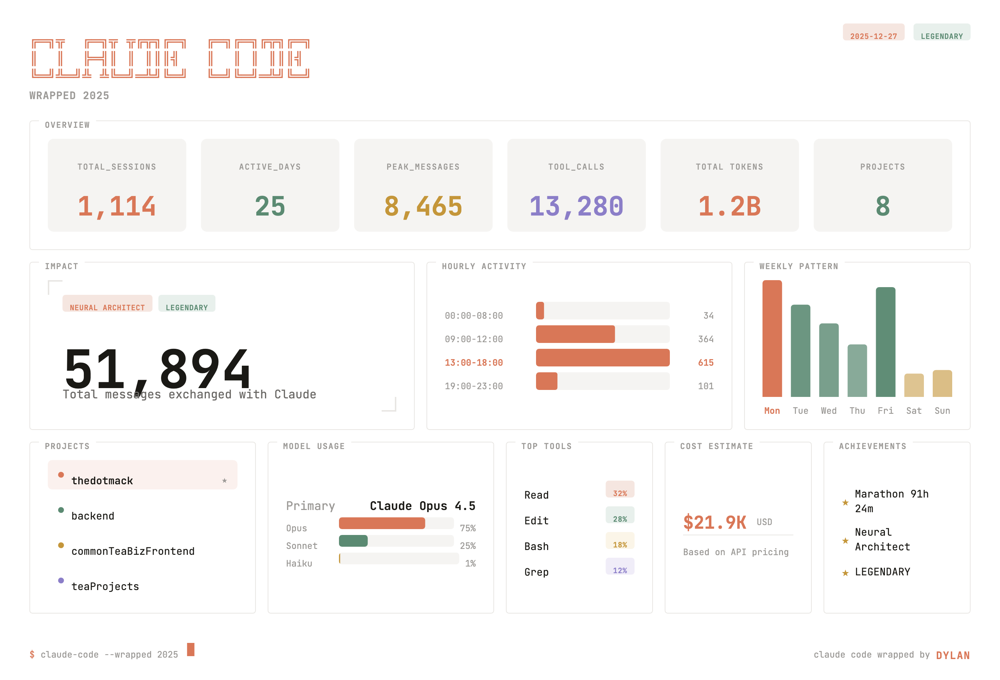
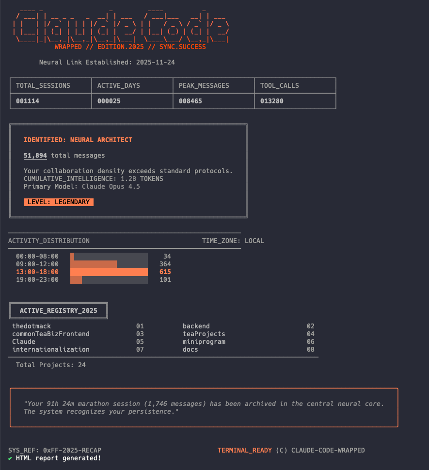

# Claude Code Wrapped 2025

```
╔═╗╦  ╔═╗╦ ╦╔╦╗╔═╗  ╔═╗╔═╗╔╦╗╔═╗  ╦ ╦╦═╗╔═╗╔═╗╔═╗╔═╗╔╦╗
║  ║  ╠═╣║ ║ ║║║╣   ║  ║ ║ ║║║╣   ║║║╠╦╝╠═╣╠═╝╠═╝║╣  ║║
╚═╝╩═╝╩ ╩╚═╝═╩╝╚═╝  ╚═╝╚═╝═╩╝╚═╝  ╚╩╝╩╚═╩ ╩╩  ╩  ╚═╝═╩╝
```

> Your year with Claude Code, beautifully visualized.


## Preview

Generate a beautiful dashboard showing your Claude Code usage statistics for 2025.

### Dashboard


### CLI


## Quick Start

```bash
# Run directly with npx
npx claude-code-wrapped

# Or install globally
npm install -g claude-code-wrapped
claude-code-wrapped
```

## Features

- **Beautiful Dashboard** - Modern, clean HTML report with export to PNG
- **Terminal TUI** - ASCII art visualization in your terminal
- **Cost Estimation** - See how much your usage would cost at API prices
- **Multi-language** - English and Chinese support
- **Cross-platform** - Works on macOS, Windows, and Linux

## Usage

```bash
# Default (English, opens HTML report)
claude-code-wrapped

# Chinese interface
claude-code-wrapped --lang zh

# Terminal only, no HTML
claude-code-wrapped --no-html

# Show help
claude-code-wrapped --help
```

## What's Tracked

| Metric | Description |
|--------|-------------|
| Sessions | Total coding sessions |
| Messages | Messages exchanged with Claude |
| Tokens | Total token consumption |
| Models | Usage breakdown by model |
| Projects | Your most active projects |
| Time | Hourly and weekly patterns |
| Cost | Estimated API cost |

## Requirements

- Node.js 18+
- Claude Code installed and used

## License

MIT © Dylan
